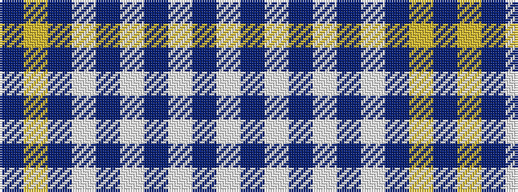

BYBWBWBWBW

It is a 10 stripe tartan.

<figure class="pat-woven">

<figcaption>idealised sample</figcaption>
</figure>

## Colour Sequence



## Tartans with this colour sequence

| Tartans |
|---------------|
| [Yorkshire, The Spirit of](/variants/s10/db19ly2db3w7db3w7db9w3db2w19~x2/)|
||
