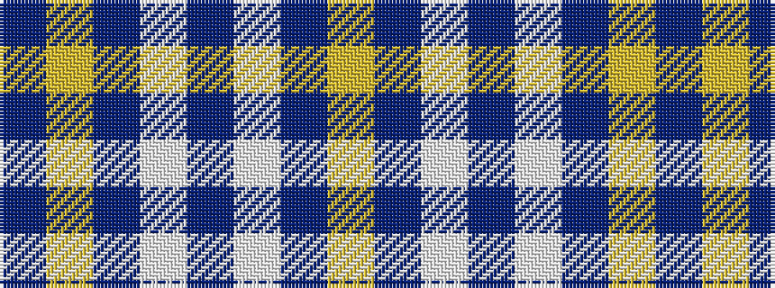

BYBWBWBY

It is a 8 stripe tartan.

<figure class="pat-woven">

<figcaption>idealised sample</figcaption>
</figure>

## Colour Sequence



## Tartans with this colour sequence

| Tartans |
|---------------|
| [Royal Warrant Holders](/variants/s8/b61ly3db2w2b20w2b4ly4~x2/)|
||
| [Royal Warrant Holders (Corporate)](/variants/s8/dt30ly2dt1w1dt10w1dt2ly2~x2/)|
||
