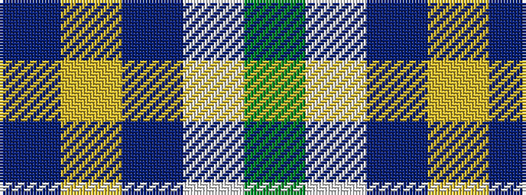

BYBWG

It is a 5 stripe tartan.

<figure class="pat-woven">

<figcaption>idealised sample</figcaption>
</figure>

## Colour Sequence



## Tartans with this colour sequence

| Tartans |
|---------------|
| [Boroughmuir](/setts/s5/dg30w8dt32ly1dt8~x2/)|
||
| [Wimbledon](/setts/s5/g30w8db32ly1db8~x2/)|
||
