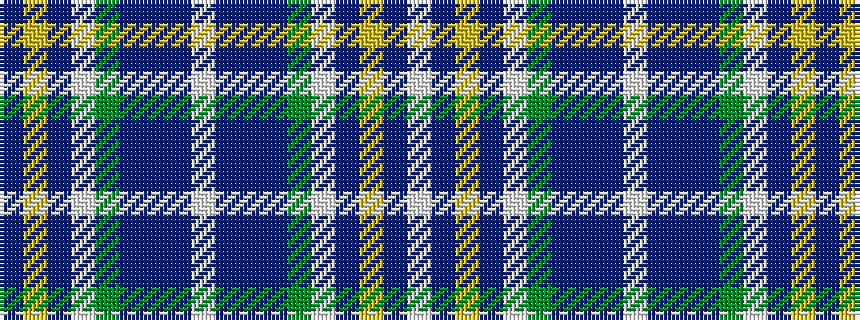

BYBWGBBBWBBBGWBYBW

It is a 18 stripe tartan.

<figure class="pat-woven">

<figcaption>idealised sample</figcaption>
</figure>

## Colour Sequence



## Tartans with this colour sequence

| Tartans |
|---------------|
| [Stewart Dress Purple Dance Tartan Tartan Number: 6551. Earliest known date: pre 1992 A D C Dalgliesh Dance variation of Stewart. See products available Copyright © Blair Urquhart, Comrie, 2015](/setts/s18/w55dp12lo2dp3w2g10dp9dp2dp6w2~x2/)|
||
