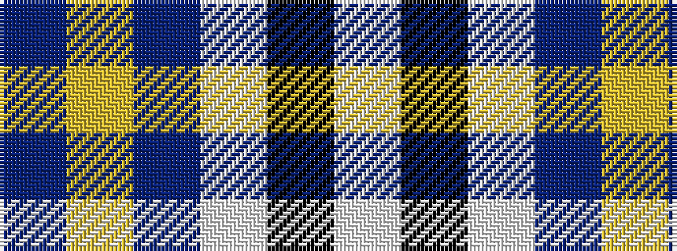

BYBWKW

It is a 6 stripe tartan.

<figure class="pat-woven">

<figcaption>idealised sample</figcaption>
</figure>

## Colour Sequence



## Tartans with this colour sequence

| Tartans |
|---------------|
| [Hawick Rugby Club (Corporate)](/setts/s6/db2ly1db7w1k7w2~x6/)|
||
