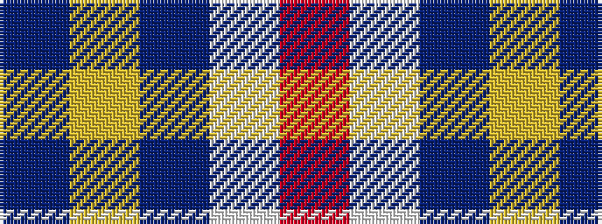

BYBWR

It is a 5 stripe tartan.

<figure class="pat-woven">

<figcaption>idealised sample</figcaption>
</figure>

## Colour Sequence



## Tartans with this colour sequence

| Tartans |
|---------------|
| [Sildesalaten](/setts/s5/r32lb4dt7ly2t2~x5/)|
||
| [Sildesalaten](/setts/s5/r32w4dt7ly2t2~x5/)|
||
