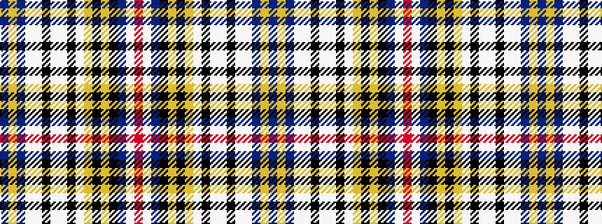

BYBWWKWWKWYKYKBWR

It is a 17 stripe tartan.

<figure class="pat-woven">

<figcaption>idealised sample</figcaption>
</figure>

## Colour Sequence



## Tartans with this colour sequence

| Tartans |
|---------------|
| [Clauwaert (Personal)](/variants/s17/db4lo2db4lb6w2k2lb6w2k2lb13lo3k4lo3k8db6w2r4~x2/)|
||
