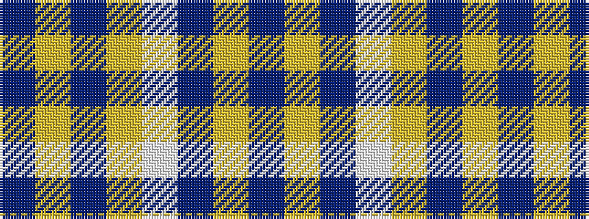

BYBWYBYB

It is a 8 stripe tartan.

<figure class="pat-woven">

<figcaption>idealised sample</figcaption>
</figure>

## Colour Sequence



## Tartans with this colour sequence

| Tartans |
|---------------|
| [Bannockbane Tan](/variants/s8/do4ly2do13ly1w13t13ly2t4~x2/)|
||
| [Bannockbane, Dark Tan](/variants/s8/dr4ly2dr13ly1w8t13ly2t4~x2/)|
||
