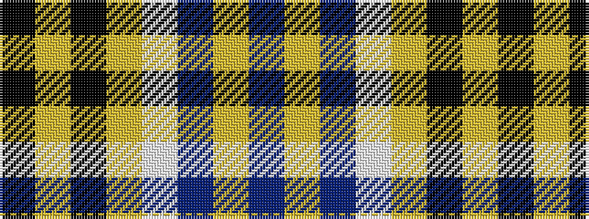

BYBWYKYK

It is a 8 stripe tartan.

<figure class="pat-woven">

<figcaption>idealised sample</figcaption>
</figure>

## Colour Sequence



## Tartans with this colour sequence

| Tartans |
|---------------|
| [Bannockbane Blue #1](/setts/s8/k4lo2k13lo1w8b13lo2b4~x2/)|
||
| [Bannockbane, Blue](/setts/s8/k4ly2k13ly1w8t13ly2t4~x2/)|
||
