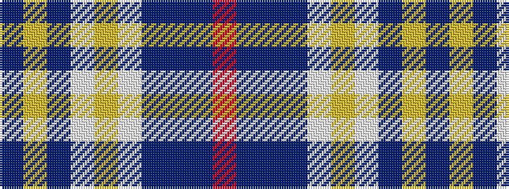

BYBWYWBBBR

It is a 10 stripe tartan.

<figure class="pat-woven">

<figcaption>idealised sample</figcaption>
</figure>

## Colour Sequence



## Tartans with this colour sequence

| Tartans |
|---------------|
| [Forfar](/variants/s10/t3ly1t23w20lo1w4db22t4db4r1~x2/)|
||
