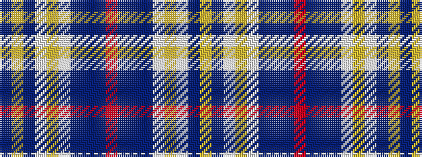

BYBWYWBBBRBBBWYWBY

It is a 18 stripe tartan.

<figure class="pat-woven">

<figcaption>idealised sample</figcaption>
</figure>

## Colour Sequence



## Tartans with this colour sequence

| Tartans |
|---------------|
| [Forfar District Tartan](/variants/s18/t3ly1t23w20lo1w4b22t4b4r1~x2/)|
||
