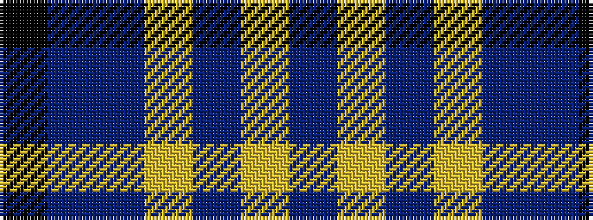

BYBYBBK

It is a 7 stripe tartan.

<figure class="pat-woven">

<figcaption>idealised sample</figcaption>
</figure>

## Colour Sequence



## Tartans with this colour sequence

| Tartans |
|---------------|
| [Charleston Police Department](/setts/s7/dp22lo10dp6lr18dp50db71k6/)|
||
