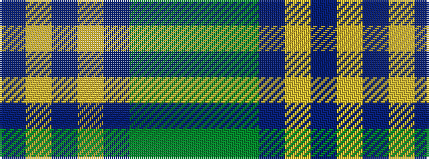

BYBYBGGG

It is a 8 stripe tartan.

<figure class="pat-woven">

<figcaption>idealised sample</figcaption>
</figure>

## Colour Sequence



## Tartans with this colour sequence

| Tartans |
|---------------|
| [Katsushika (Corporate)](/variants/s8/db22ly2db1ly2db10y2g11y6~x2/)|
||
