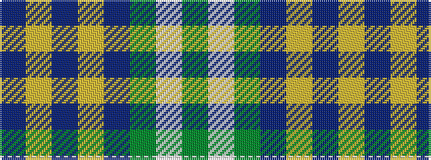

BYBYBGWG

It is a 8 stripe tartan.

<figure class="pat-woven">

<figcaption>idealised sample</figcaption>
</figure>

## Colour Sequence



## Tartans with this colour sequence

| Tartans |
|---------------|
| [MacAuliffe (Name)](/variants/s8/g37w2g6db23ly6db2ly3db2~x2/)|
||
