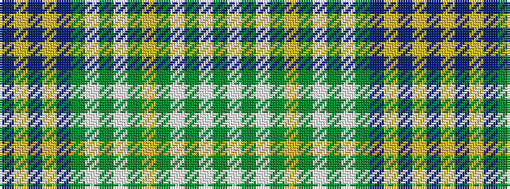

BYBYBGWGWGYGWGWG

It is a 16 stripe tartan.

<figure class="pat-woven">

<figcaption>idealised sample</figcaption>
</figure>

## Colour Sequence



## Tartans with this colour sequence

| Tartans |
|---------------|
| [MacOrrell](/variants/s16/db36ly4db10ly4db36g28w3g3w3g8ly6g8w3g3w3g28/)|
||
