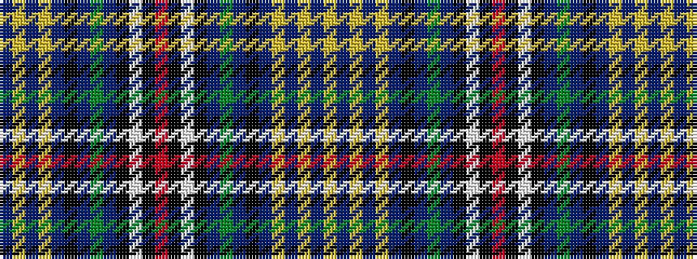

BYBYBKBGBKWKRKWKBGBKBYBYBY

It is a 26 stripe tartan.

<figure class="pat-woven">

<figcaption>idealised sample</figcaption>
</figure>

## Colour Sequence



## Tartans with this colour sequence

| Tartans |
|---------------|
| [Wupper](/setts/s26/db2ly1db2ly1db3k6db18g1db18k4w1k4r2k4w1k4db18g1db18k6db3ly1db2ly1db2ly2~x2/)|
||
