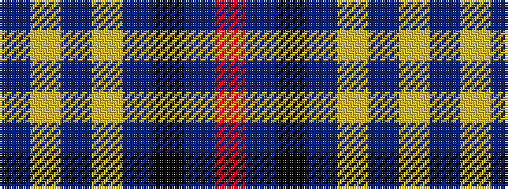

BYBYBKBR

It is a 8 stripe tartan.

<figure class="pat-woven">

<figcaption>idealised sample</figcaption>
</figure>

## Colour Sequence



## Tartans with this colour sequence

| Tartans |
|---------------|
| [European](/variants/s8/n70ly4n3ly4n7k2n2r7~x2/)|
||
