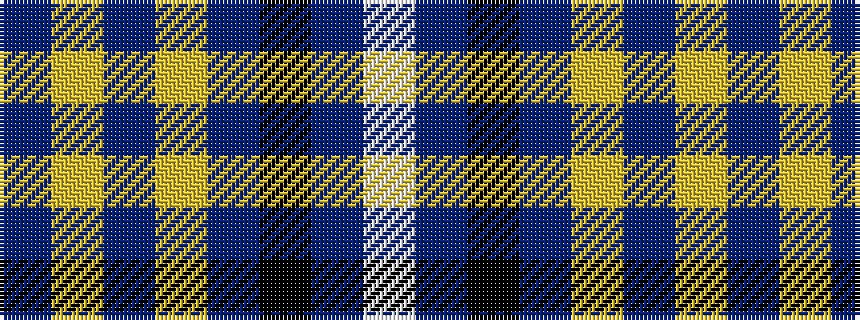

BYBYBKBW

It is a 8 stripe tartan.

<figure class="pat-woven">

<figcaption>idealised sample</figcaption>
</figure>

## Colour Sequence



## Tartans with this colour sequence

| Tartans |
|---------------|
| [Indiana #2](/variants/s8/db50ly4db3ly4db8k2dbi12w5~x2/)|
||
