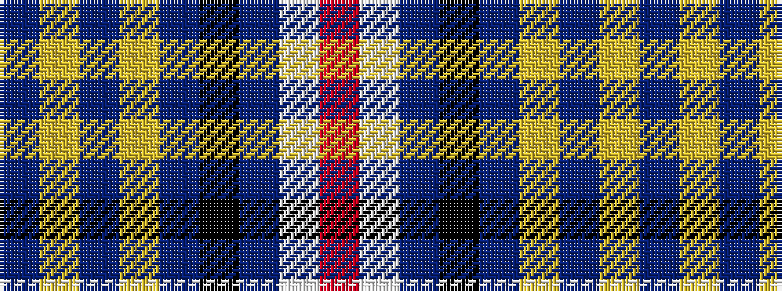

BYBYBKBWR

It is a 9 stripe tartan.

<figure class="pat-woven">

<figcaption>idealised sample</figcaption>
</figure>

## Colour Sequence



## Tartans with this colour sequence

| Tartans |
|---------------|
| [Scottish Association for Neurological Sciences](/variants/s9/db46ly4db4ly4db6k16n66lb11r6/)|
||
