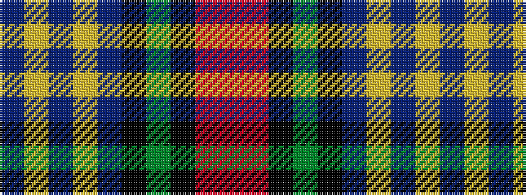

BYBYBKGKRR

It is a 10 stripe tartan.

<figure class="pat-woven">

<figcaption>idealised sample</figcaption>
</figure>

## Colour Sequence



## Tartans with this colour sequence

| Tartans |
|---------------|
| [Coleburn (Corporate)](/setts/s10/n24lo2n4lo1n3k3dg1k50r1r3~x2/)|
||
