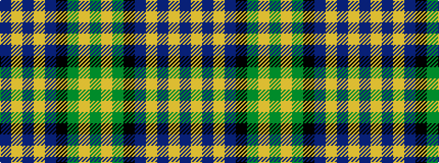

BYBYBKGYG

It is a 9 stripe tartan.

<figure class="pat-woven">

<figcaption>idealised sample</figcaption>
</figure>

## Colour Sequence



## Tartans with this colour sequence

| Tartans |
|---------------|
| [Marie Curie Fields Of Hope](/variants/s9/b12lo1b2lo1b3k5g10lo1g2~x4/)|
||
