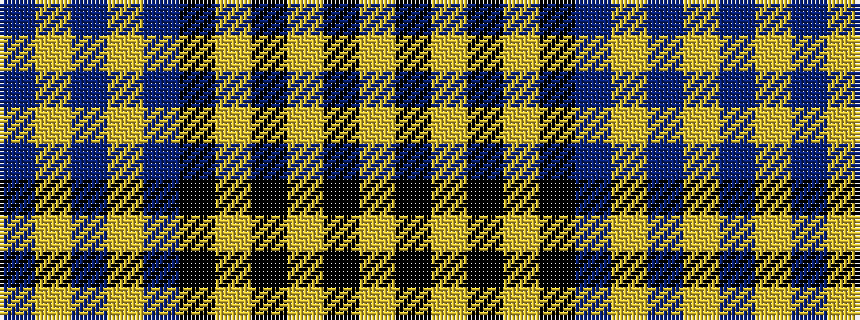

BYBYBKYKYKY

It is a 11 stripe tartan.

<figure class="pat-woven">

<figcaption>idealised sample</figcaption>
</figure>

## Colour Sequence



## Tartans with this colour sequence

| Tartans |
|---------------|
| [General Choi](/setts/s11/t3ly2t3ly2t32k28ly2k2ly2k2ly3~x2/)|
||
