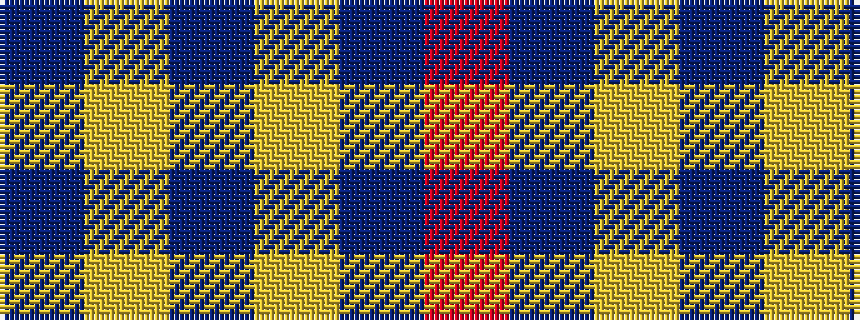

BYBYBR

It is a 6 stripe tartan.

<figure class="pat-woven">

<figcaption>idealised sample</figcaption>
</figure>

## Colour Sequence



## Tartans with this colour sequence

| Tartans |
|---------------|
| [Latin](/setts/s6/db3lo9db3lo9db20r3~x2/)|
||
| [UEFA (Glasgow)](/setts/s6/b30ly5b4r12~x4/)|
||
