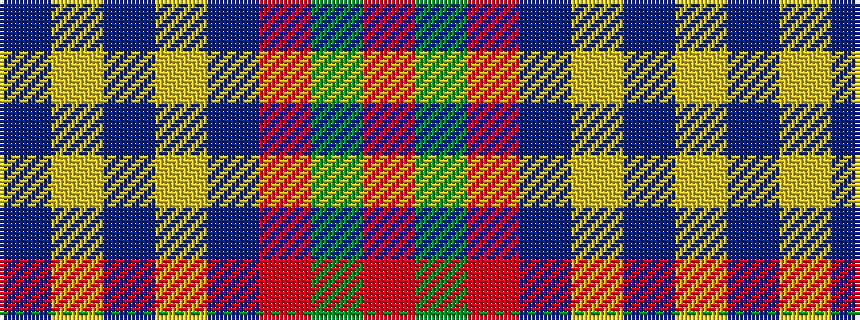

BYBYBRGR

It is a 8 stripe tartan.

<figure class="pat-woven">

<figcaption>idealised sample</figcaption>
</figure>

## Colour Sequence



## Tartans with this colour sequence

| Tartans |
|---------------|
| [Katsushika Scottish Country Dancers](/setts/s8/db22ly2db1ly2db10r2g11r6~x2/)|
||
