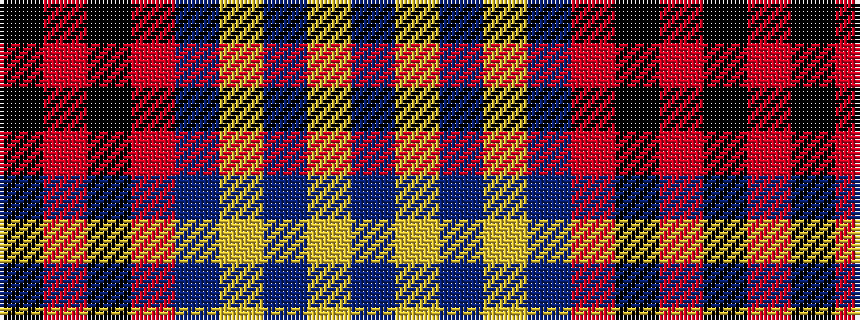

BYBYBRKRK

It is a 9 stripe tartan.

<figure class="pat-woven">

<figcaption>idealised sample</figcaption>
</figure>

## Colour Sequence



## Tartans with this colour sequence

| Tartans |
|---------------|
| [Historic Scotland (pre 1998) (Corp)](/setts/s9/dt4lr1dt1lr3dt24o9k1o9k3~x2/)|
||
