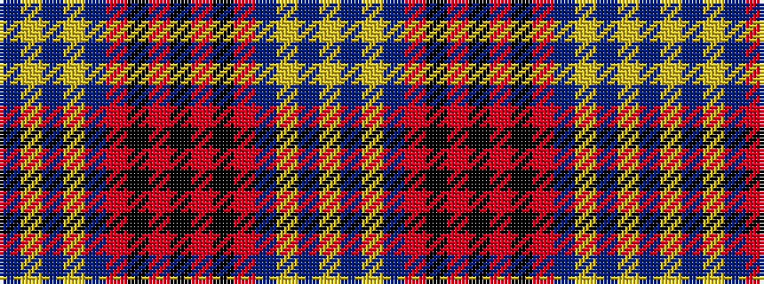

BYBYBRKRKRKRBYBY

It is a 16 stripe tartan.

<figure class="pat-woven">

<figcaption>idealised sample</figcaption>
</figure>

## Colour Sequence



## Tartans with this colour sequence

| Tartans |
|---------------|
| [Historic Scotland](/variants/s16/dt4lr1dt1lr3dt24o9k1o9k3~x2/)|
||
