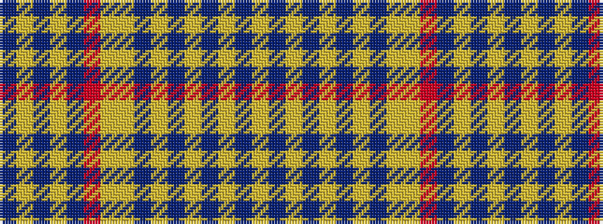

BYBYBRYYBYBYBYBY

It is a 16 stripe tartan.

<figure class="pat-woven">

<figcaption>idealised sample</figcaption>
</figure>

## Colour Sequence



## Tartans with this colour sequence

| Tartans |
|---------------|
| [Dundonald (Name)](/variants/s16/ly25db3ly3db2ly4db2ly3db3ly8ly10r16db1ly16db3ly8db2~x2/)|
||
