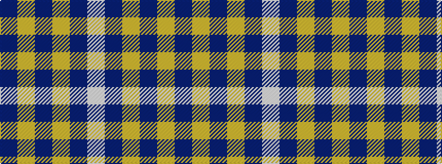

BYBYBW

It is a 6 stripe tartan.

<figure class="pat-woven">

<figcaption>idealised sample</figcaption>
</figure>

## Colour Sequence



## Tartans with this colour sequence

| Tartans |
|---------------|
| [Lucard, Stphane (Personal))](/variants/s6/w11t20ly3t8ly3t10~x2/)|
||
| [Takla Makan #2](/variants/s6/t4lo15t4lo15t4w2~x2/)|
||
| [Tokharion](/variants/s6/db1lo5db1lo5db2w1~x4/)|
||
