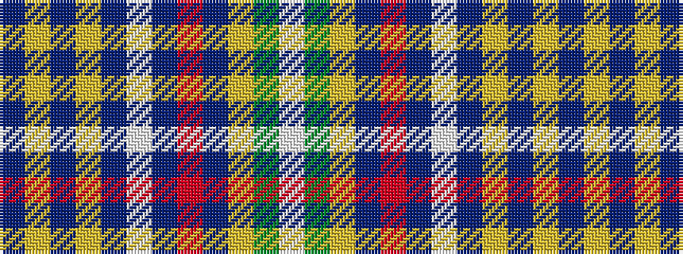

BYBYBWBRBYGW

It is a 12 stripe tartan.

<figure class="pat-woven">

<figcaption>idealised sample</figcaption>
</figure>

## Colour Sequence



## Tartans with this colour sequence

| Tartans |
|---------------|
| [Queen's University Ont. (Corporate)](/setts/s12/db54lo9db16lo2dp3w3dp3r27db13lo3g5w2~x2/)|
||
| [Queens University of Ontario Corporate Tartan Tartan Number: 2103. Earliest known date: 1966 The sett of this tartan weaves together the colours of six Queen's academic hoods: blue (Medicine), red (Arts & Science), gold (Applied Science), white (Nursing Science), green (Commerce & MBA), and Purple (Theology). Among Queen's other Scottish Traditions, inherited from its Presbyterian founders and the University of Edinburgh, are its coat of arms, its Gaelic yell, kilted Queens Bands with pipers and highland dancers, the posts of Principal and Rector, and tams for freshmen. It is marketed exclusively by the Alumni Association in support of Queen's community projects. The tartan is accredited by the Scottish Tartans Society. See products available Copyright © Blair Urquhart, Comrie, 2015](/setts/s12/db54ly9db16ly2dp3w3dp3r27db13ly3g5w2/)|
|![Queens University of Ontario Corporate Tartan Tartan Number: 2103. Earliest known date: 1966 The sett of this tartan weaves together the colours of six Queen's academic hoods: blue (Medicine), red (Arts & Science), gold (Applied Science), white (Nursing Science), green (Commerce & MBA), and Purple (Theology). Among Queen's other Scottish Traditions, inherited from its Presbyterian founders and the University of Edinburgh, are its coat of arms, its Gaelic yell, kilted Queens Bands with pipers and highland dancers, the posts of Principal and Rector, and tams for freshmen. It is marketed exclusively by the Alumni Association in support of Queen's community projects. The tartan is accredited by the Scottish Tartans Society. See products available Copyright © Blair Urquhart, Comrie, 2015 example sett](/setts/s12/db54ly9db16ly2dp3w3dp3r27db13ly3g5w2/sett.png)|
| [Queens University, of Ontario](/setts/s12/db54ly9db16ly2p3w3p3r27db13ly3g5w2/)|
||
