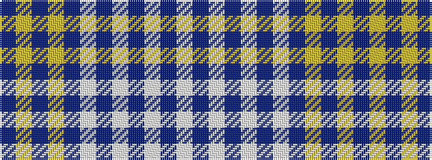

BYBYBWBWBWBW

It is a 12 stripe tartan.

<figure class="pat-woven">

<figcaption>idealised sample</figcaption>
</figure>

## Colour Sequence



## Tartans with this colour sequence

| Tartans |
|---------------|
| [Dunn (Scotland) (Name)](/variants/s12/b45ly6b3ly6b3w3db5w3db5w20b2w3~x2/)|
||
