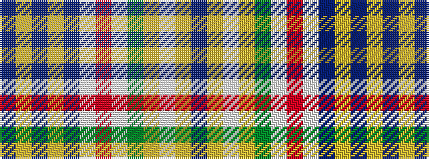

BYBYBWRWGYWYB

It is a 13 stripe tartan.

<figure class="pat-woven">

<figcaption>idealised sample</figcaption>
</figure>

## Colour Sequence



## Tartans with this colour sequence

| Tartans |
|---------------|
| [Kerr of Ardgowan Dress (Personal)](/variants/s13/dp2ly1t42lo2t6w1r1w1g4lo4w1ly1dp1~x2/)|
||
