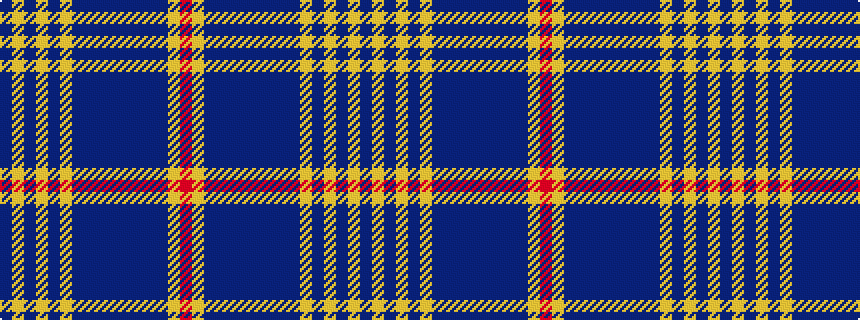

BYBYBYBBBBBBBBYR

It is a 16 stripe tartan.

<figure class="pat-woven">

<figcaption>idealised sample</figcaption>
</figure>

## Colour Sequence



## Tartans with this colour sequence

| Tartans |
|---------------|
| [Perry Golf](/variants/s16/n4ly4dt7ly4n3ly22db8n8db8n8db8n8db8n8ly34r4~x2/)|
||
