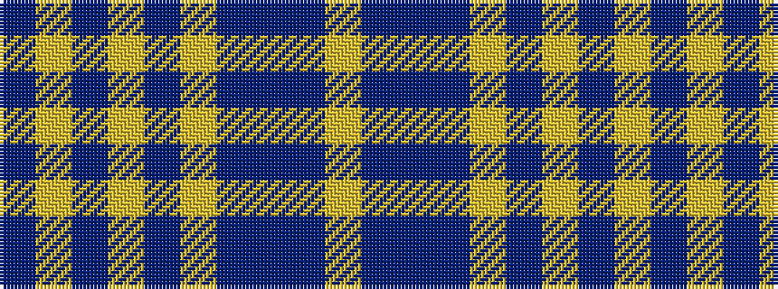

BYBYBYBBBY

It is a 10 stripe tartan.

<figure class="pat-woven">

<figcaption>idealised sample</figcaption>
</figure>

## Colour Sequence



## Tartans with this colour sequence

| Tartans |
|---------------|
| [Kenmore (Fashion)](/setts/s10/do22ly11do2ly4do2ly6do16do40do2lr6~x2/)|
||
