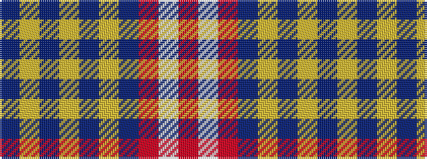

BYBYBYBRWR

It is a 10 stripe tartan.

<figure class="pat-woven">

<figcaption>idealised sample</figcaption>
</figure>

## Colour Sequence



## Tartans with this colour sequence

| Tartans |
|---------------|
| [Alpha Chi Sigma Fraternity](/setts/s10/dt35ly1dt3ly1dt3ly1dt20r6w1r5~x2/)|
||
