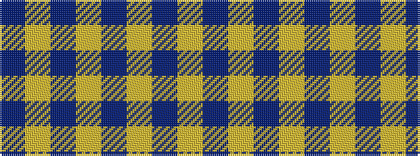

BYBYBYBY

It is a 8 stripe tartan.

<figure class="pat-woven">

<figcaption>idealised sample</figcaption>
</figure>

## Colour Sequence



## Tartans with this colour sequence

| Tartans |
|---------------|
| [MacLachlan (Chief's Dress) Blue](/setts/s8/b6ly2b21ly2b6ly24b2ly6~x2/)|
||
