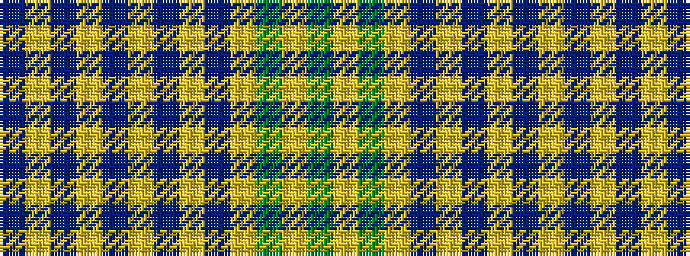

BYBYBYBYBYGYG

It is a 13 stripe tartan.

<figure class="pat-woven">

<figcaption>idealised sample</figcaption>
</figure>

## Colour Sequence



## Tartans with this colour sequence

| Tartans |
|---------------|
| [MacDonald Lord of the Isles Hunting](/setts/dg24lr1dg2lr2db2lr1db12lr1db2lr2db2lr1db12/)|
||
