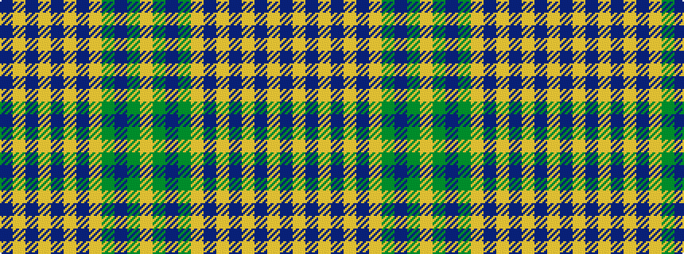

BYBYBYBYGBGY

It is a 12 stripe tartan.

<figure class="pat-woven">

<figcaption>idealised sample</figcaption>
</figure>

## Colour Sequence



## Tartans with this colour sequence

| Tartans |
|---------------|
| [Waverly Check Corporate Tartan](/variants/s12/do44lo5dr8lo2dr2lo2dr2lo14dy9dr2dy4lo2~x2/)|
||
