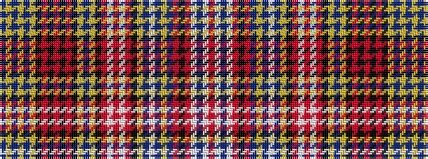

BYBYBYKRKRKRKYBYKRWRWRKYBWBYBRKRWBWR

It is a 36 stripe tartan.

<figure class="pat-woven">

<figcaption>idealised sample</figcaption>
</figure>

## Colour Sequence



## Tartans with this colour sequence

| Tartans |
|---------------|
| [Ogilvy of Airlie](/variants/s36/r14w2db3w2r14k2r2db2ly2t7w2t7ly2k4r7w1r7w1r7k4ly5t7ly5k2r2k2r2k2r2k2ly2t7ly2db3ly2db3~x2/)|
||
