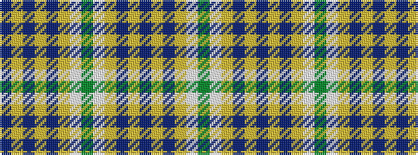

BYBYBYWGWYBYBYBYWG

It is a 18 stripe tartan.

<figure class="pat-woven">

<figcaption>idealised sample</figcaption>
</figure>

## Colour Sequence



## Tartans with this colour sequence

| Tartans |
|---------------|
| [Lamont Heather (Corporate)](/variants/s18/do18lo3do3lo3do3lo16w16y3w16lo16do17lo3do3lo3do17lo16w16y3~x2/)|
||
