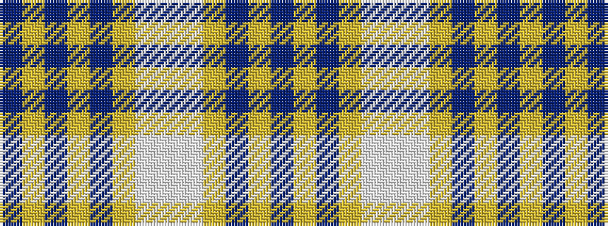

BYBYBYWWWYBYB

It is a 13 stripe tartan.

<figure class="pat-woven">

<figcaption>idealised sample</figcaption>
</figure>

## Colour Sequence



## Tartans with this colour sequence

| Tartans |
|---------------|
| [Poulter SG 104 (Fashion)](/setts/s13/db25lg8db8lg8db8lg46w46lb8w46lg46db46lg8db8/)|
||
