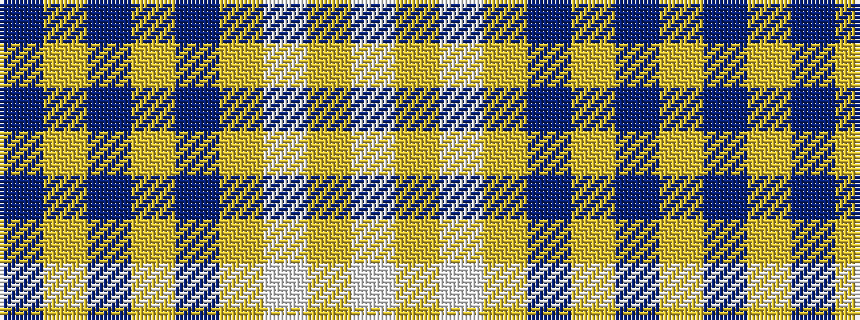

BYBYBYWYW

It is a 9 stripe tartan.

<figure class="pat-woven">

<figcaption>idealised sample</figcaption>
</figure>

## Colour Sequence



## Tartans with this colour sequence

| Tartans |
|---------------|
| [University of North Carolina at Greensboro, The](/variants/s9/db96ly11db8ly11db16ly6w4ly16w8/)|
||
