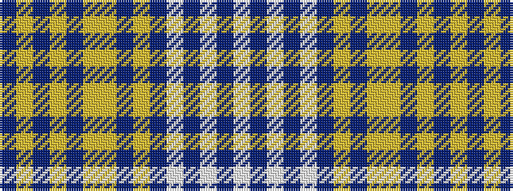

BYBYBYYBYBWBWBW

It is a 15 stripe tartan.

<figure class="pat-woven">

<figcaption>idealised sample</figcaption>
</figure>

## Colour Sequence



## Tartans with this colour sequence

| Tartans |
|---------------|
| [UPS No.1](/setts/s15/do4ly60do2ly15do2ly2lo2do2ly8do4w1do2w2do2w1~x2/)|
||
