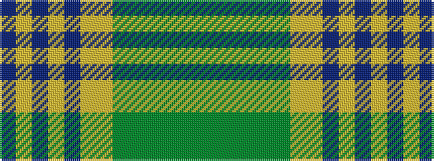

BYBYBYYGGGGGG

It is a 13 stripe tartan.

<figure class="pat-woven">

<figcaption>idealised sample</figcaption>
</figure>

## Colour Sequence



## Tartans with this colour sequence

| Tartans |
|---------------|
| [Macallan (1980s) (Corporate)](/setts/s13/g16g3g4g6g24g2lo24lo3b24lo6b4lo3b16~x2/)|
||
