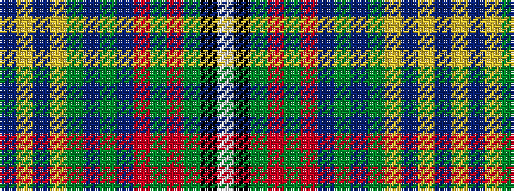

BYBYGBGBRGRGKW

It is a 14 stripe tartan.

<figure class="pat-woven">

<figcaption>idealised sample</figcaption>
</figure>

## Colour Sequence



## Tartans with this colour sequence

| Tartans |
|---------------|
| [Jones-MacGregor](/variants/s14/dt2lg2dt3lg8dg4dt4dg3dt8r12dg7r3dg2k1w1~x2/)|
||
