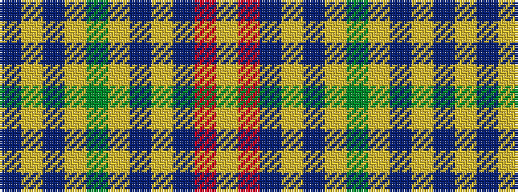

BYBYGYBYBRY

It is a 11 stripe tartan.

<figure class="pat-woven">

<figcaption>idealised sample</figcaption>
</figure>

## Colour Sequence



## Tartans with this colour sequence

| Tartans |
|---------------|
| [Craven County Commemorative Tartan](/variants/s11/n46lo1do5lo1dg5lo1dp5lo1n16r1lo4~x2/)|
||
