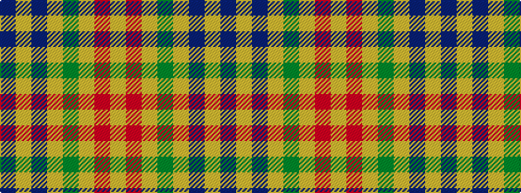

BYBYGYRY

It is a 8 stripe tartan.

<figure class="pat-woven">

<figcaption>idealised sample</figcaption>
</figure>

## Colour Sequence



## Tartans with this colour sequence

| Tartans |
|---------------|
| [Glen Moray](/setts/s8/db1lo1db13loi3y3loi3r1loi1~x4/)|
||
