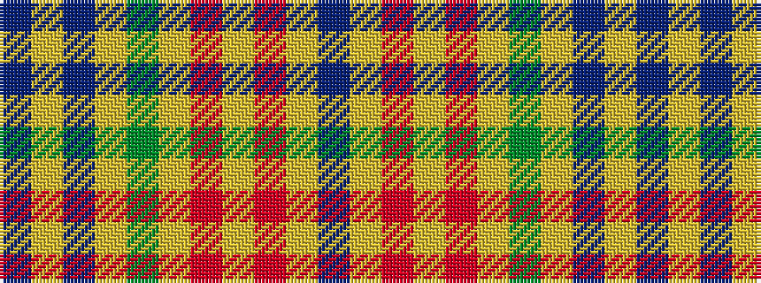

BYBYGYRYRYB

It is a 11 stripe tartan.

<figure class="pat-woven">

<figcaption>idealised sample</figcaption>
</figure>

## Colour Sequence



## Tartans with this colour sequence

| Tartans |
|---------------|
| [Unnamed C19th (Silk Sash)](/setts/s11/db7lr2dp5ly2dg7ly2r5lr2r5ly2db7~x2/)|
||
