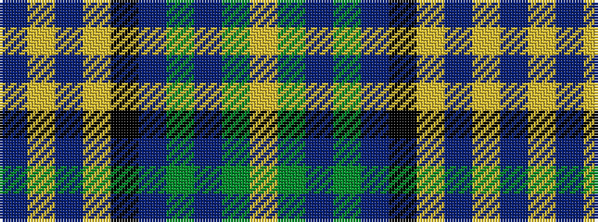

BYBYKBGBGY

It is a 10 stripe tartan.

<figure class="pat-woven">

<figcaption>idealised sample</figcaption>
</figure>

## Colour Sequence



## Tartans with this colour sequence

| Tartans |
|---------------|
| [Un-named (D C Dalgliesh) #2](/setts/s10/b5lg2b2lg9k3b9g3b3g25lr2~x2/)|
||
