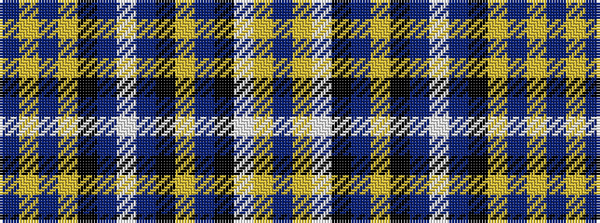

BYBYKBWBKYBKWYB

It is a 15 stripe tartan.

<figure class="pat-woven">

<figcaption>idealised sample</figcaption>
</figure>

## Colour Sequence



## Tartans with this colour sequence

| Tartans |
|---------------|
| [Motherwell Football Club Official](/variants/s15/dr20lo1dr10lo10k1dr5w1dr5k1lo5dr11k2w4lo3dr5~x2/)|
||
