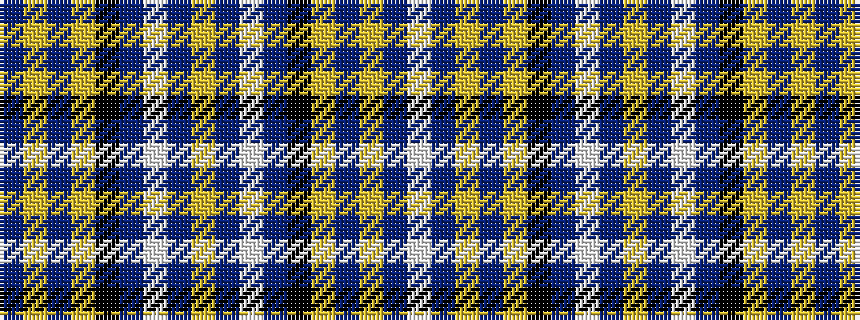

BYBYKBWBYBWBKYBYBW

It is a 18 stripe tartan.

<figure class="pat-woven">

<figcaption>idealised sample</figcaption>
</figure>

## Colour Sequence



## Tartans with this colour sequence

| Tartans |
|---------------|
| [SPA Association](/setts/s18/db5ly1db1ly1k4db15w1db2ly1db2w1db15k4ly1db1ly1db5w1~x4/)|
||
